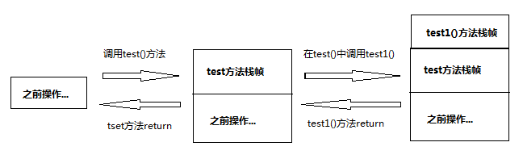
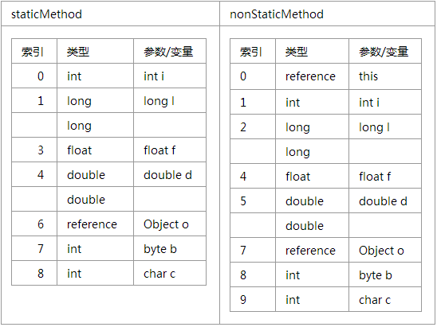
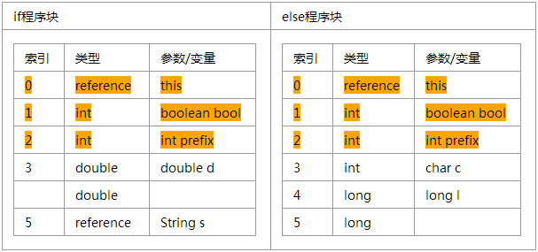

#Java栈简单描述

## JAVA栈

注：本节大部分内容源于《深入java虚拟机 第二版》5.3.7 - 5.3.8，希望更详细了解可参考原书。

每当启动一个线程，java虚拟机会为它分配一个Java栈，Java栈中存储的每一个单位是Java栈帧，Java栈只有两种操作：压栈和出栈，每当线程调用了一个Java方法的时候，虚拟机会往java栈中压入一个栈帧，而这个栈帧就是存储当前被调用的java方法的状态。当被调用方法return或者通过抛出异常中止了，虚拟机都会将当前帧弹出Java栈，比如有下面的方法：

    public void test(){
        test1();
        return;
    }
    
    public void test1(){
        return;
    }
    
假设线程执行了test()方法，那么下面就是java栈的变化过程

图一

>接下来的部分内容来自于《深入Java虚拟机第二版》，这里只提取其中一小部分有助于理解字节码操作过程的内容。

##栈帧

之前说到往java栈中每一次java方法调用都会压入一个栈帧，栈帧保存的是被调用的方法的状态，栈帧由三部分组成：局部变量区，操作数栈，帧数据区。局部变量区和操作数的大小按字长计算，并且这个大小在编译的时候就确定下来了的（如何确定这个大小，在后面介绍），或者说他并不是运行时可动态更改的。

### 局部变量区

java栈帧的的局部变量区是一个以字长为单位，从0开始计数的数组。字节码指令通过从0开始的索引来使用其中的数据。类型为int，float，reference，returnAddress，long，double。而byte，short和char类型在存入局部变量前先转变成了int类型，这些类型所占数据项如下表所示

|类型|存储类型|所占连续数据项|
|:--|:----|:--------|
|boolean|int|1|
|byte|int|1|
|char|int|1|
|short|int|1|
|int|int|1|
|float|float|1|
|reference|reference|1|
|returnAddress|returnAddress|1|
|long|long|2|
|double|double|2|

这里我们注意有个类型returnAddress，这个类型是java虚拟机内部使用的，我们在程序中是无法使用的，它主要被使用在jsr，ret，jsr\_w指令上，这个类型用来表示字节码指令的地址的，在生产finally程序块的时候会用到，但是ASMSupport中并没有用到这个类型，因为ASMSupport生成finally的策略并不是使用jsr，ret，jsr\_w指令完成的，在指令中通过使用如果想使用局部变量，就通过该变量在数组中的索引来访问，如果访问的是一个long或者double的类型的变量，则只需要改变量在数组中的连续两个数据项的第一项索引就可以了。

局部变量中存储的是当前局部变量对应的方法的参数，在该方法内申明过的变量，如果当前的方法是非静态的，还要存储一个当前方法所在对象的一个引用，也就是this关键字。下面给出一个例子：

    public class LocalVariableTest{
        public static int staticMethod(int i, long l, float f, double d, Object o, byte b){
            char c='a';
            return c;
        }
    
        public int nonStaticMethod(int i, long l, float f, double d, Object o, byte b){
            char c= 'a';
            return c;
        }
    }

上面的段代码当执行到"return s"指令的时候他们对应的局部变量如下：

通过上面我们可以看到nonStaticMethod相对于staticMethod，在第一个位置上多了一个this的引用，这this只存在于实例方法中，表示调用这个方法的对象本身，显然对于类方法staticMethod是没有this这个变量的。

对于this，java编译器始终将其放在第一个下标位置上，而方法参数，java编译器按照参数声明的顺序依次放在局部变量中，这些变量的位置都是固定了的，并且不能复用的。那么对于在方法体中声明的变量，则顺序就比较随意，并且在一定程度上是可以复用一个空间的，比如在并行的if...else...中定义的变量。

这里需要了解的一个是，虚拟机中，所有的变量都是通过局部变量数组以及下标来获取和表示的，在字节码指令中并不直接使用变量名，但是在class文件中，会用一张局部变量表来存储变量名，首先看下下面的代码：

    public void method(boolean bool)
    { // 1
        int prefix = 1; //2
        if (bool)
        { 
            double d = 2.12; //3
            String s = "string"; //4
           
            System.out.println(d + s);
            // 5
        }
        else
        {
            char c = 'a'; //6
            long l = 1L;  //7
           
            System.out.println(c + l);
            // 8
        }
        //9
    }

如果你已经看了【ASMSupport局部变量的实现】那么你就会明白这个方法的局部变量如下图：

那么针对上面的代码所生成的字节码class文件如：

     public void method(boolean bool);
     0 iconst_1
     1 istore_2 [prefix]
     2 iload_1 [bool]
     3 ifeq 42
     6 ldc2_w <Double 2.12> [16]
     9 dstore_3 [d]
    10 ldc <String "string"> [18]
    12 astore 5 [s]
    14 getstatic java.lang.System.out : java.io.PrintStream [20]
    17 new java.lang.StringBuilder [26]
    20 dup
    21 dload_3 [d]
    22 invokestatic java.lang.String.valueOf(double) : java.lang.String [28]
    25 invokespecial java.lang.StringBuilder(java.lang.String) [34]
    28 aload 5 [s]
    30 invokevirtual java.lang.StringBuilder.append(java.lang.String) : java.lang.StringBuilder [37]
    33 invokevirtual java.lang.StringBuilder.toString() : java.lang.String [41]
    36 invokevirtual java.io.PrintStream.println(java.lang.String) : void [45]
    39 goto 59
    42 bipush 97
    44 istore_3 [c]
    45 lconst_1
    46 lstore 4 [l]
    48 getstatic java.lang.System.out : java.io.PrintStream [20]
    51 iload_3 [c]
    52 i2l
    53 lload 4 [l]
    55 ladd
    56 invokevirtual java.io.PrintStream.println(long) : void [50]
    59 return
      ....
      Local variable table:
        [pc: 0, pc: 60] local: this index: 0 type: Test
        [pc: 0, pc: 60] local: bool index: 1 type: boolean
        [pc: 2, pc: 60] local: prefix index: 2 type: int
        [pc: 10, pc: 39] local: d index: 3 type: double
        [pc: 14, pc: 39] local: s index: 5 type: java.lang.String
        [pc: 45, pc: 59] local: c index: 3 type: char
        [pc: 48, pc: 59] local: l index: 4 type: long
        
在上面的字节码中我们可以看到有一个Local variable table,这就是局部变量表，这个表通过PC【参考字节码Label小节】划定范围，而PC正式上面class文件中每一条指令前面的一个数字，在这个范围内来指定局部变量数组中的某一位置的变量名名字，比如：

- **[pc: 0, pc: 60] local: bool index: 1 type: boolean :** 从第0处的PC到第60处的PC，下标为1的位置的局部变量叫做bool，类型是boolean
- **[pc: 10, pc: 39] local: d index: 3 type: double    :**  从第10处的PC到第39处的PC，下标为3的位置的局部变量叫做d，类型是double
- **[pc: 45, pc: 59] local: c index: 3 type: char      :**  从第45处的PC到第59处的PC，下标为3的位置的局部变量叫做c，类型是char

在上面我们发现个奇妙的问题，变量d和变量c使用了同一个下标，这是因为变量c和变量d分属于不同的作用域，而这两个作用域是并行的，也就是说在运行时的时候，只有一个作用域被执行的，所以这两个可以公用一个局部变量的下标。

上述说的PC具体在java代码里面如何看出来的，首先更具PC不能很准确的定位到程序中，但是根据作用域个可以大概的看出，回到上面的代码，可以看到代码中已经有注释1，2，3，4，5，6，7，8，9。那么下面就是通过这些注释大概的对应上上述class文件中的局部变量表：

- **[pc: 0, pc: 60] :**  [//1, //9] 
- **[pc: 2, pc: 60] :**  [//2, //9] 
- **[pc: 10, pc: 39] :** [//3, //5] 
- **[pc: 14, pc: 39] :** [//4, //5]
- **[pc: 45, pc: 59] :** [//6, //8]
- **[pc: 48, pc: 59] :** [//7, //8]

关于局部变量以及ASMSupport如何实现局部变量详细可以参考 【字节码声明成员变量】

### 操作数栈

 java虚拟机中的指令需要获取操作数，而这个操作数大部分存储在这个操作数栈中，操作数栈是一个标准的栈的存储结构，只做压栈和入栈的操作，和局部变量一样，操作数栈也是以字长为单位的，比如double将占用两个单位，int占用一个单位。

虚拟机把操作数栈作为它的工作区，大部分的指令的数据从这里弹出，指令执行完之后，将执行结果再压入栈内。下面的示例演示了如何将两个int类型的局部变量相加:
	
	iload_0  //从局部变量第0个位置的int类型的值压入栈
	iload_l  //从局部变量第1个位置的int类型的值压入栈
	iadd // 弹出两个栈顶值（也就是上面压入的两个值）相加，将结果压入栈顶
	istore_2 //弹出iadd操作压入的结果，将结果存到局部变量第2个下标位置
	
这里iload\_0和iload\_1和istore\_2也是是虚拟机的指令，在执行这段指令之前我们假定局部变量地0个和第1个位置均存放了int类型的值。假设局部变量第0和第1个位置的值分别是10和5，我们用图的方式更直观的表示，下图中栈是从下方入栈的。

### 帧数据区

由于ASMSupport并没有涉及到帧数据区相关的内容，所以一个部分不做解释，希望深入研究可以参考《深入java虚拟机 第二版》5.3.8。
之前介绍了java栈是由栈帧构成的，JAVA栈的具体实现是在《深入java虚拟机 第二版》5.3.8中有两种实现方法，详细可以参考原书。
